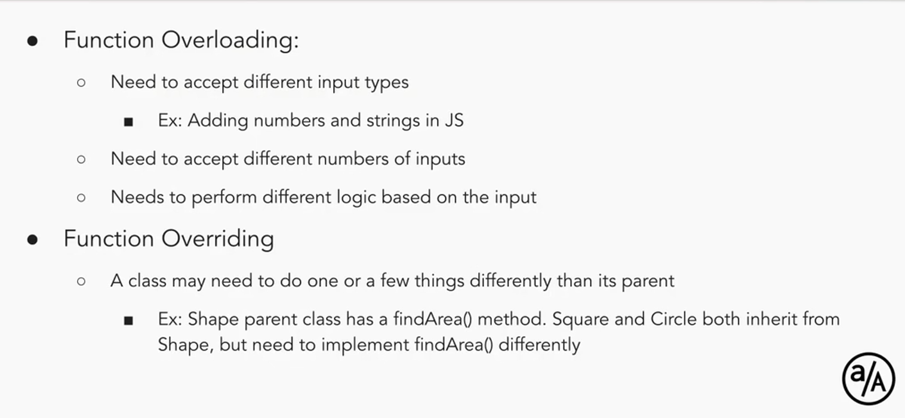

# TDD and OOP

## NPM

NPM stands for `node package manager` and it is a tool to manage node packages.

## Initialize an npm package

If your `package` is not being published, it can simply be referred to as `project`.

`npm init` command can be used to initialize a project. It generates a `package.json` file that has the configuration for the project.

## Install a package

Look up any package from the npm registry and install it using the `npm install` command.

```node
npm install chalk;
```
## Types of Dependencies

- `dependencies` : these are the dependencies (dependent packages) that your application uses while it is in production (deployed to a server ready to be used)

- `devDependencies`: these are the dependencies that are used locally while developing the application.

## Install a devDependency

To install a `devDependency` use the command `npm install dependencyname --save-dev`.

## node_modules

The code for downloaded packages is saved in the node_modules folders. It wise to add the `node_modules` to your `.gitignore` file as folder size can get very big.

## Using a package in code

Read the documentation for that package.

## Installing Dependencies in an Existing Project

Running `npm install` in the root directory of your project, having a `package.json` and `package-lock.json` file will install the packages listed inside the package-lock.json file.

## Removing a dependency

`npm uninstall <packageName>` will remove the package from your project and also update the package json files.

## Updating a dependency

`npm update <packageName>` will update the package.

## Auditing

`npm audit` comman will find security vulnerabilities in your project and provide suggestions to fix them.

## Running and Writing Scripts

`npm run <scriptName>` will run scripts defined in the `package.json` file "scripts" node.

## Local Modules

Modules within the projects (not npm packages) are called local modules.

## Exporting modules

CommonJS module export

```js

calculator.js

const operations = ['+','-','*'];

const add = () => {
    // code
}

const subtract = () => {
    // code
}

const multiply = () => {
    // code
}

module.exports.add = add;
module.exports.operations = operations;

// or

module.exports = {
    add,
    operations
}

// makes the two items import-able
```

## Import modules

`require` is used to import modules

```js
const calculator = require('calculator');
const add = calculator.add;
const operations = calculator.add;
```

## Folders as Modules

Folders can also be imported as modules, but that folder must have an `index.js` file. Node will be prompted to look for `index.js` file in that folder, and import that.

For More -> Read CommonJS imports in the documentation.

## CommonJS Modules vs ESModules

ESModules is the newer implementation.

## module object

Each module in node has access to a `module` object that represents the current module. that `module` object has an exports property that defines exports from the current module.

## Refactoring Code

Refactoring code is the process of re-writing or changing existing code to make in more readable and easier to understand for other developers, or to improve perfomance of the code. There are a few principles of refactoring.

## Single Responsibility Principle

Single Responsibility Principle states that each module, class or function should do one thing and do that well. In other words, each piece of code should only do one thing, instead of trying to achieve too many things together.

This `Separation of Concerns` will make problems easier to isolate and debug, also changes will be easier to make.

## Don't Repeat Yourself

Repeating patterns in code should be abstracted out to avoid redundancy. This will make the code more maintainable and easier to debug.

## Object Oriented Programming

Object Oriented Programming is a paradigm, which emulates real world objects in code. Each piece of code is a self contained object which combined together perform the larger functionality.

Objects have `properties` and `functionalities`.

`properties` are `attributes` that the object has - like data it stores (variables).

`functionalities` are `methods` on the object - the actions they can perform (functions).

## Breaking Down an Example with OOP

A `Pencil` API could have:

`description`-

    - tool to write on papers

`attributes` -

    - has a color. one or more.
    - has a shape
    - has a length
    - has a grade for the graphite darkness
    - might have an eraser at attached

`methods` -

    - can write
    - can be sharpened
    - can be rotated
    - might be able to erase text

summary - Object Oriented Programming is a process of breaking down a complex applications into smalled `objects` with their own properties and methods, which can be plugged in via `APIs`

## Encapsulate

To `encapsulate` is to wrap something in a black box, hiding away all the complexities of its interal functioning and exposing only the things (endpoints) that the agent needs.

Vending Machine example!

## Class

A `class` is a blueprint that is used to create an object. A `constructor` instantiates and instance of a class, i.e, instantiates an `object`

## Summary

- Encapsulation is hiding away all the nitty-gritty complex details of something in a black box and exposing only what's need. Recall Vending Machine

- Classes are blueprints that define an object

- Object is an instance of a class

- Constructor is a method that creates an instance of a class, i.e, creates an object

## How to define a class

```js
class Book {
    constructor(title, series, author) {
        this.title = title;
        this.series = series;
        this.author = author;
    }
}
```
## How to define instance methods and variables

```js
class Book {
    constructor(title, genre, author) {
        this.title = title; // instance variables
        this.genre = genre;
        this.author = author;
    }

    flipPage() {
        return `Page flipped of ${this.title}.`;
    }
}

// To create an instance

let coolBook = new Book("Metamorphosis","Fiction/Philosophy","Franz Kafka");

console.log(coolBook);
// Output
// Book {
//   title: 'Metamorphosis',
//   series: 'Fiction/Philosophy',
//   author: 'Franz Kafka'
// }

coolBook.flipPage(); // calling an instance method
// Output
// Page flipped of Metamorphosis.
```

## What are instance methods?

Instance methods are the functions, local to an object, that defines the functionality of that object

## How to check if object is instance of a call

Using `instance of`

## Definition of Classes

Classes are templates for creating objects. They encapsulate data with code to work on that data.


## what does the `this` keyword do?

`this` keyword maintains the context of our instances (Objects) when calling the instance methods.

## Static Methods

Static Methods are methods that are invoked on the class and not on any instance. They are prefixed with a static keyword

```js
class Book {
    constructor(title, author) {
        this.title = title;
        this.author = author;
    }

    getAuthor() {
        return this.author;
    }

    static getAuthors(...books) {
        return books.map(book => book.author);
    }
}

let book1 = new Book("Metamorphosis","Kafka");
let book2 = new Book("Meditations","Aurelius");

let authors = Book.getAuthors(book1, book2);
console.log(authors); // [ 'Kafka', 'Aurelius' ]
```

## Examples of uses of static methods

`Math` is a class in JavaScript which only has static methods, called on data to perform mathematical operations.

## Static Variables

Static Variables, just like static methods, are variables (properties) local to a class and are not part of any instance.

They could be useful in caching some information, storing configurations for the class, or just storing things which dont need to be part of instances.

They are declared using `static` keyword

```js
class Book {
    constructor(title, author) {
        this.title = title;
        this.author = author;

        Book.numBooks += 1;
    }

    static numBooks = 0;

    getTitle() {
        return this.title;
    }
}

let book1 = new Book("Metamorphosis","Kafka");
let book2 = new Book("Meditations","Aurelius");

let booksCreatedSoFar = Book.numBooks;

console.log(booksCreatedSoFar); // 2
```

## Inheritance

To Inherit, is to receive from your ancestor.

Inheritance in programming is the ability of child classess to inherit data and methods from their parent classes.

Example,

`Pen` and `Pencil` classes can inherit things like `bodyColor, shape, size` and methods like `writing()` from a parent class `WritingInstrument`


## Inheritance Syntax

```js
class Animal {

    constructor(name, sound) {
        this.name = name;
        this.sound = sound;
    }

    static pet(animal) {
        console.log(`You attempted to pet ${animal.name}`);
    }

    speak() {
        console.log(this.sound);
    }

}

class Dog extends Animal {
    // everything inherited from Animal class
}

let fluffy = new Dog("fluffy","woof");
fluffy.speak(); // woof
Animal.pet(fluffy); // You attempted to pet fluffy
```

## Object class

When you dont explicitly provide a parent class, classes are inherited from the `Object` class.

```js
class Animal {}

// same as

class Animal extends Object {
}
```

## super keyword

`super` keyword can be used to call the constructor of the parent class inside the child class

```js
class Animal {
    constructor(name, sound) {
        this.name = name;
        this.sound = sound;
    }

    static pet(animal) {
        console.log(`You attempted to pet ${animal.name}`);
    }

    speak() {
        console.log(this.sound);
    }
}

class Dog extends Animal {
    constructor(name) {
        super(name, "woof"); // every dog will have a woof sound
    }
}

let fluffy = new Dog("fluffy"); // only have to pass a name
fluffy.speak(); // woof;
```

## Interesting Behaviour

```js
class Fruit {
  constructor(color, taste) {
    this.color = color;
    this.taste = taste;
  }

  eat() {
    // name of the constructor function
    console.log(`You ate a ${this.constructor.name}.`);
  }
}

class Apple extends Fruit {
  constructor() {
    super('red', 'sweet');
  }
}

const orange = new Fruit('orange', 'tangy');
const apple = new Apple();
apple.eat(); // You ate a Apple
```

## Polymorphism

Polymorphism is the ability to take multiple forms.

In OOP, Polymorphism is changing or 'morphing' an existing implementation for each class.


In Simpler words, `Polymorphism` in Object Oriented Programming is extending the parent's methods in the child class to do something more or different than the parent.



## How to implement polymorphism

One way polymorphism could be implemented is `method overriding`, where a child class overrides the parent's method.

You do that by creating a new method on a class (can be `instance method` or `static method`) with the same name.

```js
class Business {
    toString() {
        console.log("Give us your money");
    }
}

class ClothingStore extends Business {
    toString() {
        console.log("Buy clothes you don't need");
    }
}

let store = new ClothingStore();
store.toString(); // Buy clothes you don't need
```

## Using `super` to call a parent's method

`super` can be used inside the child's instance method to call the parent's method with the same name.

## `this` keyword

`this` keyword refers to the object that is currently calling a method.

## Method Style invocation

Method style invocation, or dot-notation, is when a method is called on an object like `object.method(args)`. This ensures that the `this` inside the method is set to the object them method is called upon

## Context

**Context** refers to the value of `this` within a function and `this` refers to where the function is invoked

## `strict mode`

`strict mode` is used to protect the global object by accidental mutations by running functions in unintended contexts

## Scope vs Context

Scope refers to the visibility and availability of variables, whereas Context refers to the value of `this` in the code.

## Bind

When `bind` is called, it returns a function that has `this` bound to a provided value, no matter where it is called.

```js
let boundFunc = func.bind(context);
```

Magic of `bind` is that you can choose the context for your functions.

```js
class Cat {
    constructor(name) {
        this.name = name
    }

    purr() {
        console.log("purr");
    }

    purrMore() {
        this.purr();
    }
}

let cat = new Cat("Meowser");

const purr = cat.purrMore;

purr(); // purr is not defined

// binding

let boundPurr = purr.bind(cat);

boundPurr(); // "meow"
```

Another Example

```js

class Cat {
    constructor(name) {
        this.name = name;
    }

    sayName() {
        console.log(`My name is ${this.name}`);
    }
}

class Dog {
    constructor(name) {
        this.name = name;
    }
}


let cat = new Cat("meowser"):
let dog = new Dog("fido");

let sayName = cat.sayName;

sayNameCat = sayName.bind(cat);
sayNameDog = sayName.bind(dog);

sayNameCat(); // My name is meowser
sayNameDog(); // My name is fido

```
to summarise, `bind` function returns a functions with a set `this` keyword.

`call`, `apply` and `bind`, all three serve the same purpose, i.e to call a function with an explicit context.

<a href="https://www.youtube.com/watch?v=YOlr79NaAtQ">FireShip Video</a>

## `apply` and `call`

`apply` and `call` are two more methods that can be used to bind a context to a function. They are different from `bind` as `bind` returns a new function with its `this` set that can be called multiple times, whereas `apply` and `call` invoke the function directly with the passed on context.

`apply` takes an array of arguments and `call` takes comma separated values

```js
let result = saySomething.apply(context,[...args]);
let result = saySomething.call(context, ...args);
```

```js
class Dog {
    constructor(name) {
        this.name = name;
    }
}

class Cat {
    constructor(name) {
        this.name = name;
    }

    sayName() {
        console.log(`${this.name} says meow`);
    }
}

let dog = new Dog("fido");
let cat = new Cat("meowser");

cat.sayName.call(dog); // fido says meow
cat.sayName.apply(dog);
```

`call` and `apply` are same except the way they take arguments. apply can take at most two arguments, second one being the array of arguments, whereas call takes comman separated arguments.


## Exercise

```js
class Employee {
    constructor(name, occupation) {
        this.name = name;
        this.occupation = occupation;
    }

    sayName() {
        console.log(`${this.name} says hello`);
    }

    sayOccupation() {
        console.log(`${this.name} is a ${this.occupation}`);
    }
}

let jwick = new Employee("John Wick","Dog Lover");

setTimeout(jwick.sayName,2000);
// undefined says hello


setTimeout(jwick.sayOccupation,3000);
// undefined is a undefined

// the instance methods are being passed to setTimeout as callbacks,
// so at runtime, the context is changed and thus this is undefined

// fix

setTimeout(jwick.sayName.bind(jwick),2000);
setTimeout(jwick.sayOccupation.bind(jwick),3000);

```


## Questions:

- How to define a class using ES6 syntax with a constructor method
- How to define instance methods and variables
- How to create an instance using the new keyword
- What instance methods are
- How to call instance methods on an instance
- How to check if an object is an instance of a class using the instanceof operator.
- How to debug common bugs when using classes in JavaScript
- `this` keyword?
